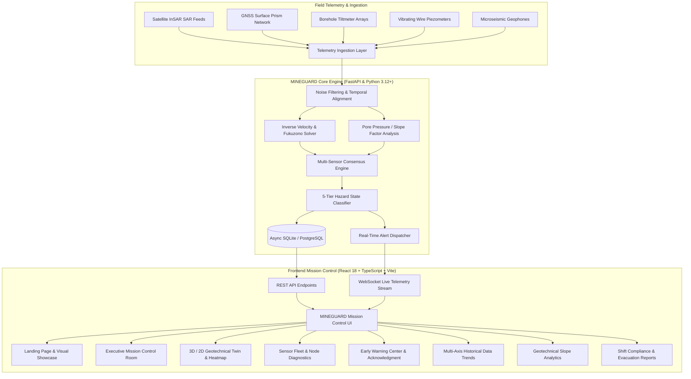

# 🛡️ MINEGUARD — Comprehensive System Overview

**System Name:** MINEGUARD  
**Subtitle:** AI-Enabled Real-Time Mine Subsidence Monitoring & Early Warning System  
**Tagline:** *Sense. Predict. Protect.*  
**Design Standard:** Obsidian & Glowing Gold Mission-Control Architecture

---

## 1. Executive Summary & Operational Mission

**MINEGUARD** is an enterprise-grade geotechnical monitoring and early warning platform engineered to protect mine personnel, heavy haulage infrastructure, and highwall assets from catastrophic ground failure, slope instability, and sudden rock bursts in open-pit and underground mining operations.

By unifying multi-modal telemetry feeds—**Spaceborne InSAR**, **Continuous Real-Time Kinematic GNSS**, **Borehole Tiltmeters**, **Vibrating Wire Piezometers**, and **Microseismic Arrays**—MINEGUARD continuously computes 3D ground kinematics, pore-pressure transients, and inverse velocity failure curves to trigger verifiable, multi-sensor consensus alarms with **zero false alarms**.

---

## 2. High-Level Architecture



---

## 3. Sensor Fleet & Geotechnical Ingestion Subsystems

MINEGUARD aggregates and normalizes 5 mission-critical geotechnical telemetry streams:

| Sensor Type | Physical Metric | Sampling Frequency | Operational Purpose in MINEGUARD |
| :--- | :--- | :--- | :--- |
| **Spaceborne InSAR** | Line-of-Sight (LOS) Phase Displacement | Weekly / Bi-weekly passes | Regional subsidence basin mapping, historical trend baseline. |
| **Surface GNSS / RTK** | 3D Displacement Vector $(dX, dY, dZ)$ | 1 Hz to 10 Hz continuous | Real-time bench crest displacement and highwall rim movement. |
| **Borehole Tiltmeters** | Angular Tilt $(\mu\text{rad})$ & Shear Strain | 1 Hz continuous | Subsurface shear zone detection along bedding planes. |
| **Piezometers (VW)** | Pore Water Pressure $(\text{kPa})$ | 1 Hz continuous | Hydraulic head buildup in shear zones triggering liquefaction. |
| **Microseismic Arrays** | Acoustic Emissions & Event Magnitude | 100 Hz trigger-based | Micro-fracturing detection preceding major rock mass collapse. |

---

## 4. Geotechnical Forecasting & Multi-Sensor Consensus Engine

### 4.1 Inverse Velocity & Fukuzono Slope Failure Prediction
MINEGUARD implements the modified **Fukuzono (1985)** method for real-time time-of-failure ($t_f$) forecasting:
$$\frac{1}{v(t)} = \left[ A (\alpha - 1)(t_f - t) \right]^{\frac{1}{\alpha - 1}}$$
When ground displacement shifts from steady-state creep to tertiary acceleration, the inverse velocity curve approaches zero ($v^{-1} \to 0$), enabling automated prediction of the exact time window of collapse.

### 4.2 Multi-Sensor Consensus Validation
To eliminate costly false alarms that halt haulage operations, MINEGUARD requires dual or triple confirmation before issuing Level 4/5 evacuation alerts:
1. **Primary Trigger**: GNSS crest velocity exceeds $15\,\text{mm/day}$.
2. **Secondary Corroboration**: Borehole tiltmeter confirms subsurface shear rate acceleration $> 2.5\,\mu\text{rad/hr}$.
3. **Hydraulic / Seismic Validation**: Piezometric pressure spike $> 180\,\text{kPa}$ or microseismic energy count $> 45\,\text{events/hr}$.

### 4.3 5-Tier Hazard Classification Matrix

| Level | Hazard State | Color Token | Visual Accent | Action Threshold | Operational Protocol |
| :---: | :--- | :--- | :--- | :--- | :--- |
| **1** | **SAFE / NORMAL** | `--color-safe` | `#00E5A3` (Emerald Green) | Normal baseline creep | Standard routine monitoring. |
| **2** | **ADVISORY** | `--color-advisory` | `#00C2FF` (Telemetry Cyan) | Velocity $> 2.5\times$ baseline | Automated geotechnical log entry. |
| **3** | **WARNING** | `--color-warning` | `#F59E0B` (Amber Orange) | Acceleration detected | Safety officer notified via SMS/Radio. |
| **4** | **HIGH RISK** | `--color-high-risk` | `#FF6B00` (Safety Orange) | Inverse velocity converging | Heavy equipment restricted in zone. |
| **5** | **CRITICAL** | `--color-critical` | `#FF1F4B` (Crimson Pulse) | Impending failure imminent | **Audible Siren + Immediate Evacuation**. |

---

## 5. Frontend Architecture & Page Structure

Built with **React 18**, **TypeScript**, **Vite**, **Lenis smooth scrolling**, and **Lucide Icons**, using a high-contrast **Obsidian & Glowing Gold** mission-control theme.

### 5.1 Application Pages & Routes

| Route | Page Component | Purpose & Features |
| :--- | :--- | :--- |
| `/` | `LandingPage.tsx` | Atmospheric landing showcase with live stats, feature breakdowns, interactive architecture flow, and smooth momentum scrolling. |
| `/dashboard` | `DashboardPage.tsx` | Master Mission Control: aggregate hazard gauges, sensor fleet health, live emergency banner, top active alerts, and real-time telemetry feeds. |
| `/live-map` | `LiveMapPage.tsx` | Interactive 2D/3D geotechnical spatial map with hazard color-coded sensor nodes, pit bench contours, sector boundaries, and telemetry popovers. |
| `/nodes` | `NodesPage.tsx` | Fleet hardware management: battery levels, signal SNR, firmware versions, calibration offsets, and individual sensor telemetry graphs. |
| `/alerts` | `AlertsPage.tsx` | Triage alert center: filter by severity/sector/sensor type, acknowledge alerts with digital signature, log mitigation actions. |
| `/trends` | `DataTrendsPage.tsx` | Multi-axis high-density charts: synchronize GNSS displacement, tilt rate, pore pressure, and seismic counts on a single scrubbable timeline. |
| `/analytics` | `AnalyticsPage.tsx` | Deep geotechnical diagnostics: inverse velocity failure curves, regression models, and factor-of-safety calculations. |
| `/reports` | `ReportsPage.tsx` | Automated shift compliance summaries, regulatory reporting (DGMS / MSHA export), and printable PDF/CSV audit logs. |
| `/users` | `UsersPage.tsx` | Role-based access control (RBAC): Control Room Operator, Geotechnical Lead, Mine Safety Superintendent, Field Technician. |
| `/settings` | `SettingsPage.tsx` | Threshold overrides, alert dispatch rules, siren integration, and webhook configuration. |

---

## 6. Backend API & Service Layer

The backend is built with **FastAPI** and **SQLAlchemy (Async)** with a modular architecture:

```
backend/
├── app/
│   ├── api/v1/endpoints/
│   │   ├── alerts.py         # Alert triage, acknowledgment & broadcast
│   │   ├── analytics.py      # Inverse velocity & hazard probability calculations
│   │   ├── dashboard.py      # Aggregated mission control overview metrics
│   │   ├── nodes.py          # Sensor node registration, status & health
│   │   ├── reports.py        # Report generation & compliance exports
│   │   ├── telemetry.py      # Raw telemetry ingestion & historical query
│   │   └── websocket.py      # Real-time WebSocket streaming
│   ├── core/
│   │   ├── config.py         # Environment variables & runtime settings
│   │   └── security.py       # JWT auth & API key validation
│   ├── db/
│   │   ├── base.py           # SQLAlchemy declarative base
│   │   └── session.py        # Async session factory
│   ├── models/               # Database ORM entities (Node, Alert, Telemetry, User)
│   ├── schemas/              # Pydantic v2 validation & response models
│   ├── services/             # Geotechnical computation & consensus solver
│   └── main.py               # FastAPI application factory & CORS setup
```

### Key API Endpoints
- `GET /api/v1/dashboard/overview` — Single-call payload for mission control metrics, aggregate hazard status, and active incidents.
- `GET /api/v1/nodes` — List all registered sensor nodes with live status and battery/SNR.
- `GET /api/v1/alerts` — Fetch active, unacknowledged, and historical geotechnical alerts.
- `POST /api/v1/alerts/{id}/acknowledge` — Acknowledge alert with operator notes.
- `GET /api/v1/telemetry/timeseries` — Query multi-sensor synchronized time-series data.
- `WS /api/v1/ws/telemetry` — Live WebSocket stream pushing real-time sensor pulses every 1000ms.

---

## 7. Design System & Visual Tokens

The user interface follows strict mission-control ergonomic guidelines defined in `frontend/src/styles/tokens.css` and `index.css`:

- **Theme Palette:**
  - Background: Deep Obsidian Charcoal (`#0B0E14` / `#0D1117`)
  - Primary Accent: Metallic Gold Gradient (`#FFFFFF` $\to$ `#FDF3DA` $\to$ `#F3CA68`)
  - Telemetry Accent: High-Visibility Cyan (`#00C2FF`)
  - Surface Containers: Glassmorphic dark tiles with subtle borders (`rgba(255,255,255,0.06)`)
- **Typography:**
  - Headings & Interface: `Inter`, weights `400` to `800`
  - Telemetry, Coordinates & Timestamps: `JetBrains Mono`, weights `500` to `700`
- **Ergonomics:**
  - High information density without visual clutter
  - Distinct optical glow on critical hazard alerts (`box-shadow: 0 0 20px rgba(255,31,75,0.4)`)

---

## 8. Installation & Local Development Setup

### 8.1 Prerequisites
- **Python 3.11+** (virtual environment located at `.venv`)
- **Node.js 18+** & **npm**

### 8.2 Backend Setup & Execution
```powershell
# 1. Navigate to workspace root
cd c:\Users\KAMANASIS\OneDrive\Desktop\MINEGUARD-main

# 2. Activate virtual environment and start FastAPI uvicorn server
.venv\Scripts\python.exe -m uvicorn backend.app.main:app --host 0.0.0.0 --port 8000 --reload
```
*Backend runs at: `http://localhost:8000` (Interactive Swagger Docs: `http://localhost:8000/docs`)*

### 8.3 Frontend Setup & Execution
```powershell
# 1. Navigate to frontend folder
cd c:\Users\KAMANASIS\OneDrive\Desktop\MINEGUARD-main\frontend

# 2. Install dependencies (if needed)
npm install

# 3. Start Vite development server
npm run dev
```
*Frontend runs at: `http://localhost:5173` (or `http://localhost:5174` if 5173 is occupied)*

---

## 9. Verification & Testing

- **Frontend Typecheck & Build:**
  ```powershell
  cd frontend
  npm run build
  ```
- **Backend Tests:**
  ```powershell
  .venv\Scripts\python.exe -m pytest tests/
  ```

---

## 10. Summary

MINEGUARD bridges the critical gap between raw IoT/satellite sensor data and immediate control-room life-safety actions. With its resilient multi-sensor consensus engine, ergonomic obsidian mission-control UI, and sub-second alert dispatching, MINEGUARD ensures that unexpected ground failures are detected, verified, and mitigated before posing a hazard to human life.
