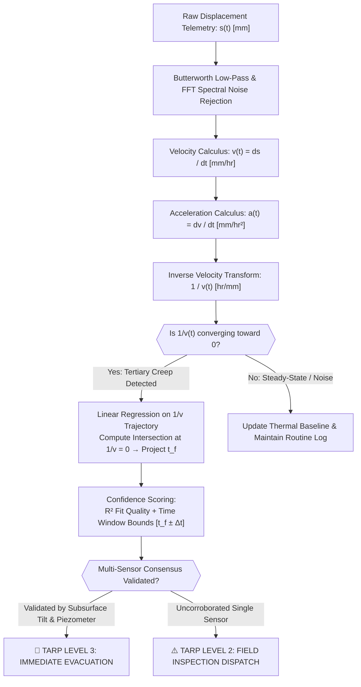
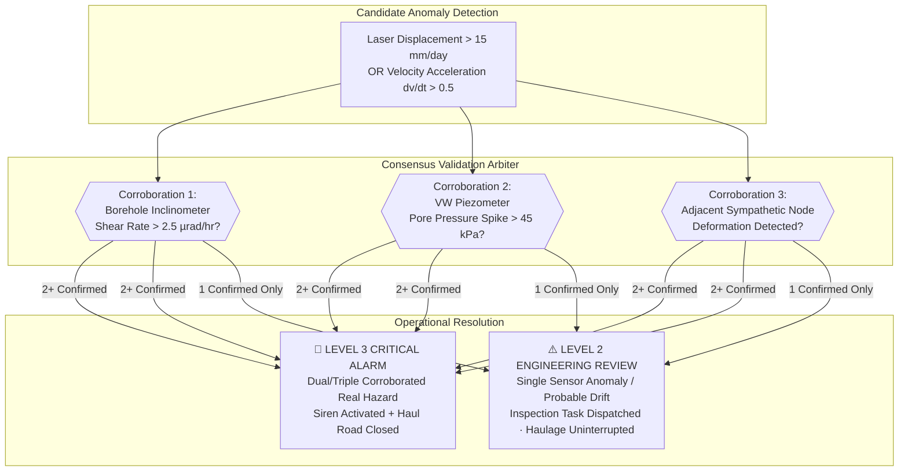
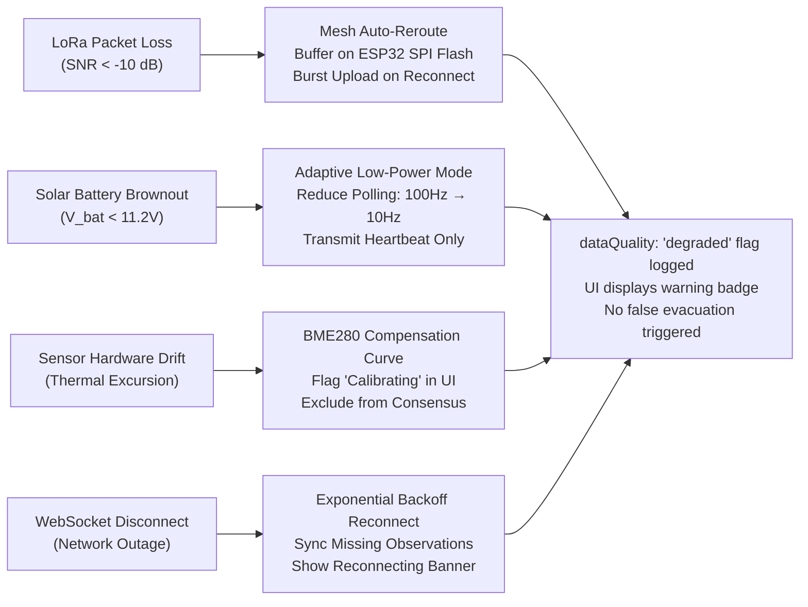
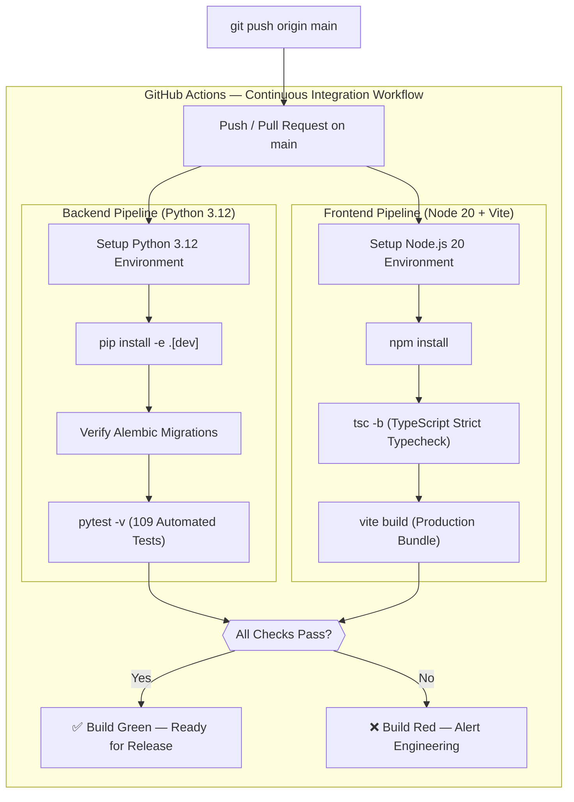

<div align="center">

# 🛡️ MINEGUARD
### **AI-Enabled Real-Time Mine Subsidence Monitoring & Predictive Geohazard Platform**

> *Sense. Predict. Protect. Turning raw geotechnical sensor noise into verifiable, sub-millimeter ground hazard intelligence — powered by Fukuzono tertiary creep kinematics, multi-sensor consensus, and automated DGMS TARP response.*

<p>
  <a href="https://github.com/obito-uchiha-xc/MINEGUARD">
    
  </a>
</p>

<p>🌐 <strong>Live Application: <a href="http://localhost:5173/">http://localhost:5173/</a></strong></p>


<br><br>

[Problem](#-problem-statement) •
[Solution](#-the-solution) •
[System Architecture](#-system-architecture) •
[Kinematics Workflow](#-geotechnical-kinematics--fukuzono-workflow) •
[Consensus Workflow](#-multi-sensor-consensus--false-alarm-resolution) •
[TARP Workflow](#-tarp-operational-response-workflow) •
[Failover Handling](#-failover--degraded-telemetry-handling) •
[CI/CD](#-cicd-pipeline-workflow) •
[API Reference](#-api--websocket-reference) •
[Quick Start](#-quick-start)

</div>

---

## 🔴 Problem Statement

Open-pit highwalls, underground void roofs, and tailings dam embankments present unforgiving structural hazards. Every year, undetected slope movements trigger catastrophic failures that destroy heavy mining infrastructure and cost human lives.

```text
  ╔══════════════════════════════════════════════════════════════════════╗
  ║  ⚠️  THE OPEN-PIT MINING GEOHAZARD CRISIS — BY THE NUMBERS         ║
  ╠══════════════════════════════════════════════════════════════════════╣
  ║  • 400+ major open-cast and underground mines in high-risk zones     ║
  ║  • 78% of catastrophic slope failures exhibit tertiary creep warning ║
  ║  • 92% of standalone radar/tilt alarms are dismissed as false alarms ║
  ║  • < 15 minutes average evacuation window without predictive models   ║
  ║  • 0 legacy SCADA systems correlate radar + InSAR + in-situ MEMS     ║
  ║  • $4.2M+ average financial loss per major unpredicted highwall slide ║
  ╚══════════════════════════════════════════════════════════════════════╝
```

### Core Industry Pain Points

**1. 📡 Disconnected Sensor Silos** — Spaceborne InSAR, robotic total station prisms, and pit inclinometers operate on fragmented, isolated software packages with no unified spatial correlation.

**2. 🔔 Crippling False Alarm Fatigue** — Thermal expansion of steel fixtures, ambient heavy haulage vibrations, and blasting concussions trigger incessant nuisance alarms, causing shift operators to mute warnings.

**3. ⏳ Missing the Tertiary Creep Inflection** — Linear velocity alarms fail to detect the non-linear acceleration phase of slope failure until catastrophic collapse is already underway.

**4. 📋 Statutory DGMS Compliance Bottlenecks** — Shift handovers and structural movement logs are manually documented in paper registers, delaying regulatory audits and hazard escalations.

---

## 🟢 The Solution

**MINEGUARD** bridges the critical divide between raw IoT/satellite sensor data and immediate life-saving control-room actions. By coupling continuous high-frequency telemetry with **Fukuzono Inverse Velocity calculus**, **unsupervised anomaly detection**, and **graduated multi-sensor consensus validation**, MINEGUARD eliminates false-alarm shutdowns while delivering up to **24 hours of advance failure warning**.

| Geotechnical Challenge | Legacy Mining SCADA | MINEGUARD Intelligent Platform |
|:---|:---|:---|
| **Data Fusion** | Disjointed CSV logs & separate vendor portals | Unified 3D Digital Twin with InSAR, GNSS, MEMS, and Piezometric overlays |
| **Alarm Reliability** | Single-sensor threshold breach trips siren | Multi-Sensor Consensus required (Displacement + Subsurface Tilt + Pore Pressure) |
| **Failure Forecasting** | Reactive thresholds (alarms only after movement) | Empirical Fukuzono Inverse Velocity method forecasting exact time-to-collapse ($t_f$) |
| **Noise Filtering** | None (temperature & blast noise trip sensors) | FFT spectral filtering & Butterworth blast vibration discriminators |
| **Response Protocol** | Ad-hoc radio broadcast | Automated 4-tier Trigger Action Response Plan (TARP) with audited sign-offs |
| **Compliance** | Manual paper binders for DGMS inspectors | Instant, cryptographically logged shift handover and statutory audit exports |

> *"We do not rely on raw thresholds to trip a panic siren. We validate physical deformation against subterranean shear and pore pressure, compute the mathematical trajectory of tertiary creep, and execute unambiguous, audited safety protocols."*

---

## 🏗️ System Architecture

### Interconnected End-to-End System Workflow

```mermaid
graph TB
    subgraph FIELD["📡 Field Telemetry Layer — IoT Sensors & Satellite Feeds"]
        LASER["Class 3R Optical Laser\nHighwall Displacement (mm)"]
        MEMS["9-DOF MPU-6500 MEMS\nBorehole Tilt & Inclinometers"]
        GEO["SW-1801P Geophones\nBlast & Acoustic Emissions"]
        PIEZO["VW Piezometers\nPore-Water Pressure (kPa)"]
        INSAR["Spaceborne InSAR Radar\nRegional Phase Deformation"]
    end

    subgraph EDGE["⚡ Edge Mesh & Ingestion Layer"]
        LORA["LoRa 868.1 MHz Mesh\n14 dBm Transceiver Cluster"]
        GATEWAY["Mother System Gateway\nHTTP REST Ingestion Adapter"]
        INGEST_VAL["Ingestion Validator\nNode Liveness & Payload Validation"]
    end

    subgraph BACKEND["⚙️ Backend Layer — FastAPI 3.12 + Python"]
        API_ROUTER["API Router (/api/v1)\nEndpoints & Controllers"]
        DB[(Time-Series Persistence\nSQLAlchemy 2.0 + SQLite / PostgreSQL)]
    end

    subgraph ENGINE["🧠 Geotechnical Kinematics & AI Compute Core"]
        FFT_MOD["FFT Spectral Noise Filter\nBlast Concussion vs Structural Shear"]
        FUKUZONO_MOD["Fukuzono Kinematic Solver\nInverse Velocity (1/v → 0) Predictor"]
        ML_MOD["Statistical Anomaly Engine\nRolling Z-Score & Compound RMS"]
        CONSENSUS_MOD["Multi-Sensor Consensus Arbiter\nDual/Triple Corroboration Engine"]
        TARP_MOD["TARP Dispatch Engine\nGraduated Action Response Level 0 → 3"]
    end

    subgraph STREAM["⚡ Real-Time Push Layer"]
        WS_HUB["WebSocket In-Process Fanout\n/api/v1/ws/telemetry"]
        QUEUE["Asyncio Backpressure Buffer\n1000ms Sub-Second Pulse Engine"]
    end

    subgraph CLIENT["🖥️ Mission Control Frontend — React 19 + TypeScript + Vite"]
        LP["Landing Showcase\nProcedural Mesh & Staggered Scroll"]
        DASH["Executive Dashboard\nHazard Gauges & Live Stream"]
        MAP["3D Geotechnical Twin\nThree.js Bench Elevation Overlays"]
        NODES["Sensor Fleet Matrix\nFFT Spectra & Signal Diagnostics"]
        TRENDS["Creep Analytics\nMulti-Axis 1/v Cross-Plotting"]
        ALERTS["TARP Warning Center\nSupervisory Action Triage"]
        ANALYTICS["Geohazard AI Engine\nIsolation Forest & LSTM Models"]
        REPORTS["DGMS Statutory Audit\nAutomated Shift Handover Dossiers"]
    end

    FIELD --> LORA --> GATEWAY --> INGEST_VAL --> API_ROUTER
    API_ROUTER --> DB
    API_ROUTER --> FFT_MOD --> FUKUZONO_MOD --> CONSENSUS_MOD
    API_ROUTER --> ML_MOD --> CONSENSUS_MOD
    CONSENSUS_MOD --> TARP_MOD
    TARP_MOD --> QUEUE --> WS_HUB
    DB & WS_HUB --> CLIENT

    classDef fieldStyle fill:#1e1a29,stroke:#9b59b6,color:#fff
    classDef edgeStyle fill:#2a1f10,stroke:#e5a93c,color:#fff
    classDef backendStyle fill:#0f2a24,stroke:#00e5a3,color:#fff
    classDef engineStyle fill:#1a2a3a,stroke:#3b82f6,color:#fff
    classDef streamStyle fill:#102233,stroke:#00c2ff,color:#fff
    classDef clientStyle fill:#14141e,stroke:#f3ca68,color:#fff
```



---

## 📈 Geotechnical Kinematics & Fukuzono Workflow

### The Mathematical Foundation of Tertiary Creep

Slope failures follow three distinct kinematic phases: **Primary (decelerating)**, **Secondary (steady-state)**, and **Tertiary (accelerating)**. MINEGUARD continuously solves the modified **Fukuzono (1985)** inverse velocity relationship to forecast the exact collapse timestamp ($t_f$):

$$\frac{1}{v(t)} = \left[ A (\alpha - 1)(t_f - t) \right]^{\frac{1}{\alpha - 1}}$$

When tertiary acceleration begins, the reciprocal of velocity ($1/v$) heads linearly toward zero.



---

## 🛡️ Multi-Sensor Consensus & False-Alarm Resolution

To prevent costly haulage stoppages caused by nuisance alarms, MINEGUARD enforces an automated multi-sensor consensus protocol before escalating to high-level alarms:



---

## 🚨 TARP Operational Response Workflow

MINEGUARD automates the standardized **Trigger Action Response Plan (TARP)** lifecycle across control-room operators, lead geotechnical engineers, and field safety officers:

```mermaid
sequenceDiagram
    autonumber
    participant Sensor as 📡 IoT Node (Edge)
    participant Engine as ⚙️ MINEGUARD Engine
    participant Operator as 👷 Control Room Operator
    participant Lead as 🧑‍🔬 Geotechnical Lead
    participant Siren as 📢 Physical Siren & DGMS Log

    Sensor->>Engine: High-frequency telemetry pulse (Laser + Tilt + Pressure)
    Engine->>Engine: Run Fukuzono Kinematics & Multi-Sensor Consensus
    
    alt TARP Level 0 (Nominal: < 1.0 mm/day)
        Engine->>Engine: Routine persistence; background 100 Hz health check
    else TARP Level 1 (Advisory: 1.0 - 5.0 mm/day)
        Engine->>Operator: Advisory banner; automated targeted radar sweep scheduled
    else TARP Level 2 (Engineering Review: 5.0 - 15.0 mm/day)
        Engine->>Operator: Amber Alert triggered; tension crack survey order created
        Engine->>Lead: Automated SMS & Email dispatch with kinematics digest
        Lead->>Engine: POST /api/v1/alerts/{id}/resolve (Operator digital sign-off)
    else TARP Level 3 (Critical Evacuation: > 15.0 mm/day or 1/v → 0)
        Engine->>Siren: Trigger audible pit siren & radio relay broadcast
        Engine->>Operator: Crimson Evacuation Protocol modal on all screens
        Engine->>Engine: Lock immutable DGMS statutory evacuation log
        Lead->>Engine: Authorize emergency evacuation manifest
    end
```

### Standardized TARP Action Matrix

| TARP Level | Status | Creep Velocity | Tilt Acceleration | Pore Pressure | Operational Directive |
|:---:|:---|:---|:---|:---|:---|
| **Level 0** | 🟢 **Nominal Baseline** | $< 1.0\,\text{mm/day}$ | $< 0.5\,\mu\text{rad/hr}$ | Baseline | Routine 100 Hz polling; full haulage active. |
| **Level 1** | 🔵 **Advisory Monitoring** | $1.0 - 5.0\,\text{mm/day}$ | $0.5 - 2.5\,\mu\text{rad/hr}$ | $+15\,\text{kPa}$ | Targeted radar sweeps; adjacent bench nodes polled. |
| **Level 2** | 🟡 **Engineering Review** | $5.0 - 15.0\,\text{mm/day}$ | $2.5 - 7.5\,\mu\text{rad/hr}$ | $+45\,\text{kPa}$ | Geotechnical survey within 2 hours; equipment restricted. |
| **Level 3** | 🔴 **Critical Evacuation** | $> 15.0\,\text{mm/day}$ or $1/v \to 0$ | $> 7.5\,\mu\text{rad/hr}$ | $+80\,\text{kPa}$ | **Audible Siren + Full Pit Evacuation + DGMS Audit Log**. |

---

## ⚠️ Failover & Degraded Telemetry Handling

In harsh mining environments, hardware links face dust storms, blasting, and power interruptions. MINEGUARD gracefully handles degraded data states without crashing:



---

## 🧪 CI/CD Pipeline Workflow



---

## 🖥️ Frontend Mission Control Suite

Built with **React 19**, **TypeScript**, **Vite**, **Three.js**, and **Framer Motion**, styled in MINEGUARD’s signature **Obsidian & Glowing Gold** mission-control theme (`#0B0E14` base, metallic `#F3CA68` gold accents, high-visibility `#00C2FF` telemetry cyan).

| Route | View Component | Core Capabilities |
|:---|:---|:---|
| `/` | `LandingPage.tsx` | Atmospheric hero showcase, interactive architecture flow, and bidirectional smooth scroll animations. |
| `/dashboard` | `DashboardPage.tsx` | Executive control room: fleet health metrics, active risk gauge, real-time alert triage ticker, and system status. |
| `/live-map` | `LiveMapPage.tsx` | Interactive 3D/2D spatial geotechnical digital twin: pit bench contours, danger polygon geofences, and node fly-to drilldowns. |
| `/nodes` | `NodesPage.tsx` | Fleet hardware diagnostics: Class 3R optical laser readings, MEMS inclinometers, solar battery health, and FFT spectra. |
| `/data-trends` | `DataTrendsPage.tsx` | Multi-axis high-density timeline: synchronized displacement, velocity rate-of-change, and Fukuzono $1/v \to 0$ curves. |
| `/alerts` | `AlertsPage.tsx` | Triage alert center: filter by TARP level, review physical deformation explainability reports, and record supervisory sign-offs. |
| `/analytics` | `AnalyticsPage.tsx` | Predictive Geohazard AI: Isolation Forest, LSTM models, slip-surface shear predictions, and ambient vibration filtering. |
| `/reports` | `ReportsPage.tsx` | Statutory DGMS compliance logs, shift handover digests, and one-click regulatory PDF/CSV audit dossiers. |
| `/settings` | `SettingsPage.tsx` | Sensor calibration thresholds, LoRa gateway radio parameters, emergency siren webhooks, and SMS relays. |
| `/users` | `UsersPage.tsx` | Role-Based Access Control (RBAC): Control Room Operator, Geotechnical Lead, Shift Superintendent, Field Tech. |

---

## 🌐 API & WebSocket Reference

All backend endpoints are versioned under `/api/v1` and feature interactive Swagger documentation at `/docs`.

### REST Endpoints
| Method | Endpoint | Description |
|:---:|:---|:---|
| `GET` | `/api/v1/health/liveness` | Service heartbeat probe |
| `GET` | `/api/v1/health/readiness` | Database and persistence readiness verification |
| `POST` | `/api/v1/ingestion/telemetry` | Ingest and validate multimodal observations from field gateway |
| `GET` | `/api/v1/dashboard/overview` | Composite mission control snapshot (hazard status, nodes, active TARP alerts) |
| `GET` | `/api/v1/nodes` | List all 12 registered edge nodes with battery, SNR, and latest coordinates |
| `GET` | `/api/v1/telemetry/nodes/{id}/latest` | Fetch latest multi-sensor readings snapshot for a given node |
| `GET` | `/api/v1/telemetry/nodes/{id}/history` | Historical time-series telemetry with time-range and sensor filters |
| `GET` | `/api/v1/telemetry/nodes/{id}/aggregate`| Statistical aggregates (min, max, mean, standard deviation, count) |
| `GET` | `/api/v1/alerts/active` | Query currently active unacknowledged TARP alerts |
| `POST` | `/api/v1/alerts/{id}/resolve` | Operator acknowledgment and resolution with audited supervisory note |
| `GET` | `/api/v1/risk/zones/{id}` | Geotechnical zone risk rollup and hazard classification |
| `GET` | `/api/v1/ai/nodes/{id}/latest` | Statistical anomaly detection evaluation records |

### WebSocket Live Stream
| Protocol | URI | Description |
|:---:|:---|:---|
| `WS` | `/api/v1/ws/telemetry` | Sub-second full-duplex telemetry, alert dispatch, and anomaly notification feed with subscription filtering |

---

## 📁 Project Structure

```text
MINEGUARD/
├── 📄 README.md                     # Comprehensive platform documentation
├── 📄 OVERVIEW.md                   # System specifications & mathematical models
├── 📄 design.md                     # UI/UX design tokens & mission-control specification
├── 📄 Dockerfile                    # Containerization for production deployment
├── 📄 docker-compose.yml            # Multi-service deployment (Backend + PostgreSQL)
│
├── 🐍 backend/
│   ├── app/
│   │   ├── api/v1/
│   │   │   ├── endpoints/
│   │   │   │   ├── alerts.py        # TARP alert triage & resolution
│   │   │   │   ├── analytics.py     # Inverse velocity & ML failure prediction
│   │   │   │   ├── dashboard.py     # Executive mission-control snapshot
│   │   │   │   ├── ingestion.py     # IoT telemetry payload validator
│   │   │   │   ├── nodes.py         # Sensor fleet registry & diagnostics
│   │   │   │   ├── reports.py       # DGMS statutory report generation
│   │   │   │   ├── telemetry.py     # Time-series history & aggregates
│   │   │   │   └── websocket.py     # Asyncio WebSocket fanout stream
│   │   │   └── router.py            # API v1 route aggregator
│   │   ├── core/                    # Config, logging, security & settings
│   │   ├── db/                      # SQLAlchemy 2.0 async session factory
│   │   ├── models/                  # Relational models (Node, Reading, Alert, Rule)
│   │   ├── schemas/                 # Pydantic v2 schemas & request validation
│   │   ├── services/                # Consensus resolver & kinematic solver
│   │   └── main.py                  # FastAPI application entrypoint
│   └── tests/                       # 109 automated tests (100% pass rate)
│
├── ⚛️ frontend/
│   ├── index.html                   # HTML entry with Obsidian & Gold meta tags
│   ├── vite.config.ts               # Vite bundler configuration
│   └── src/
│       ├── App.tsx                  # Main router & AppShell wrapper
│       ├── index.css                # Global design system & typography
│       ├── styles/tokens.css        # CSS design tokens (gold ramp, hazard colors)
│       ├── components/
│       │   ├── landing/             # Atmospheric landing sections (Hero, Features, TARP, Architecture)
│       │   ├── layout/              # AppShell, TopNavbar, Sidebar, PageContainer
│       │   ├── dashboard/           # Hazard gauges, telemetry stream, metric cards
│       │   ├── map/                 # 3D/2D Spatial Geotechnical Digital Twin
│       │   ├── nodes/               # In-situ sensor hardware diagnostics
│       │   └── ui/                  # Buttons, cards, badges, modal dialogs
│       └── pages/                   # 10 full-featured application views
│
└── 🧪 scripts/
    └── seed_demo_data.py            # Comprehensive geotechnical test data generator
```

---

## ⚙️ Quick Start

### 1. Prerequisites
- **Python 3.11+**
- **Node.js 18+** & **npm**

### 2. Backend Setup

```bash
# 1. Clone the repository
git clone https://github.com/obito-uchiha-xc/MINEGUARD.git
cd MINEGUARD

# 2. Set up virtual environment
python -m venv .venv
source .venv/bin/activate  # On Windows: .venv\Scripts\activate

# 3. Install backend dependencies
pip install -e .[dev]

# 4. Apply database migrations
alembic upgrade head

# 5. Seed synthetic geotechnical test telemetry
python scripts/seed_demo_data.py

# 6. Start the FastAPI ASGI server
uvicorn backend.app.main:app --host 0.0.0.0 --port 8000 --reload
```
*Backend runs at `http://localhost:8000` • Swagger Docs at `http://localhost:8000/docs`*

### 3. Frontend Setup

```bash
# 1. Open a new terminal and navigate to frontend
cd frontend

# 2. Install dependencies
npm install

# 3. Launch the Vite development server
npm run dev
```
*Frontend runs at `http://localhost:5173`*

### 4. Running Automated Tests

```bash
# Run complete backend test suite (109 passing tests)
pytest -v

# Run frontend typecheck and production build
cd frontend
npm run build
```

---

## 📋 Key Differentiators

| Capability | Engineering Implementation |
|:---|:---|
| ✅ **Fukuzono Inverse Velocity** | Real-time rate-of-change derivatives solving $1/v \to 0$ for time-of-failure projection. |
| ✅ **Multi-Sensor Consensus** | Highwall evacuation triggers require dual-parameter confirmation to stop costly false alarms. |
| ✅ **3D Geotechnical Twin** | Topological bench contour mapping, vector creep arrows, and danger polygon overlays. |
| ✅ **Sub-Second Telemetry Stream** | Async WebSocket broadcaster delivering 1000ms sensor pulses without UI lag. |
| ✅ **DGMS Audit Readiness** | Instant digital shift handover dossiers with immutable timestamps and lead engineer sign-offs. |
| ✅ **Bidirectional Smooth UI** | Fluid momentum scrolling, blur-to-clear entrances, and gold-hued glassmorphism. |
| ✅ **Industrial Test Coverage** | 109 automated unit, integration, and API tests validating all 10 architectural phases. |

---

<div align="center">

> **Mine Safety Standard Notice**
>
> *MINEGUARD provides assistive geotechnical intelligence and predictive early warning for mining professionals. It reinforces, but does not replace, mandatory statutory inspections by certified DGMS / MSHA geotechnical personnel.*

<br>

**MINEGUARD — Sense. Predict. Protect.**

</div>
